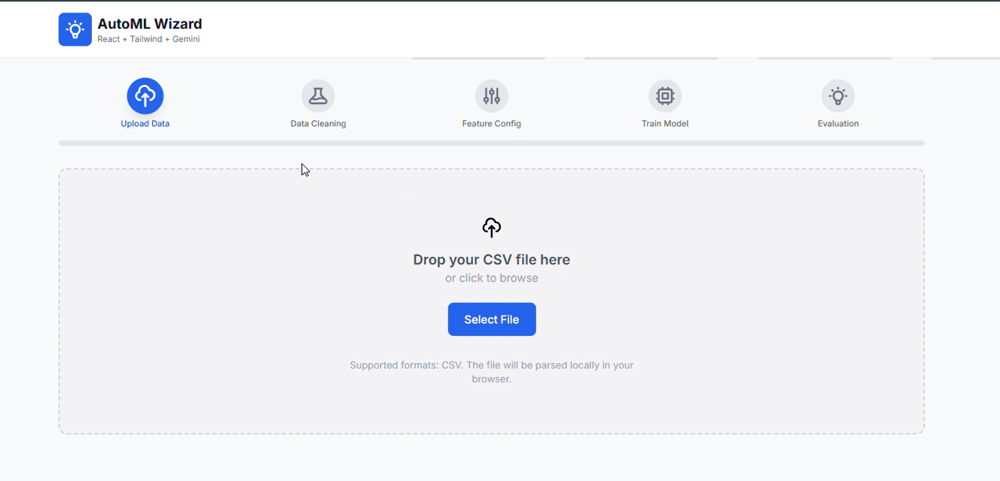
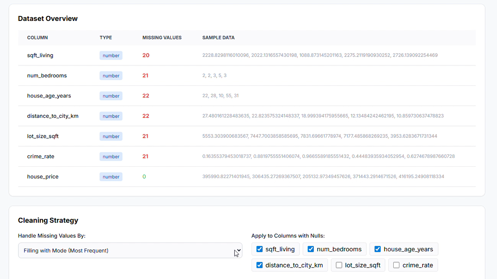
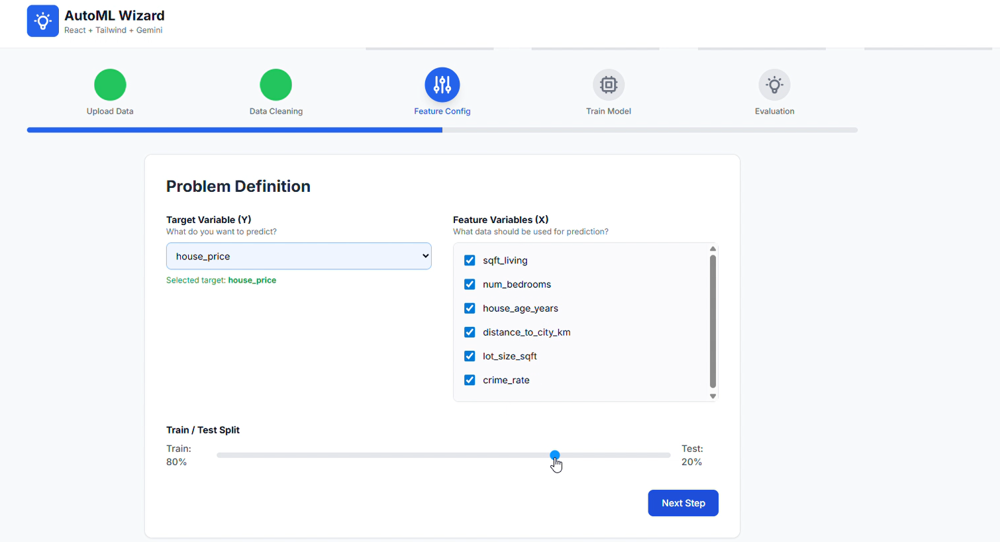
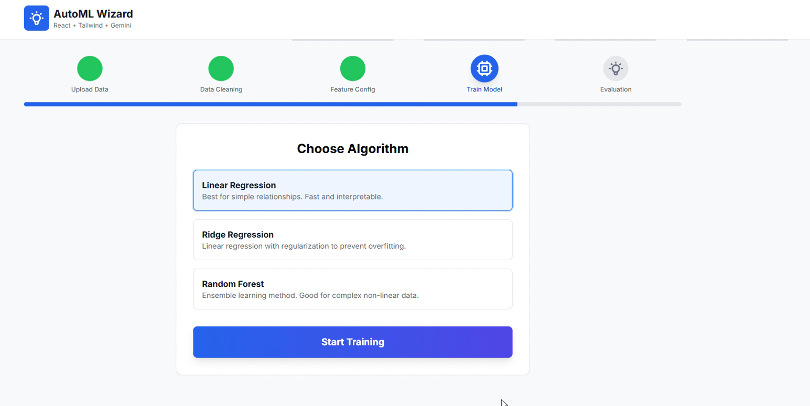
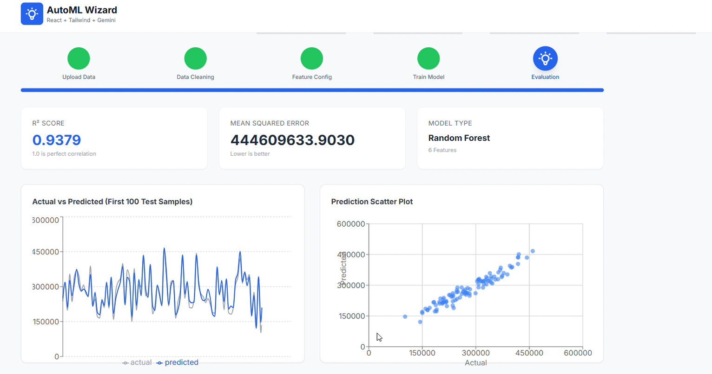
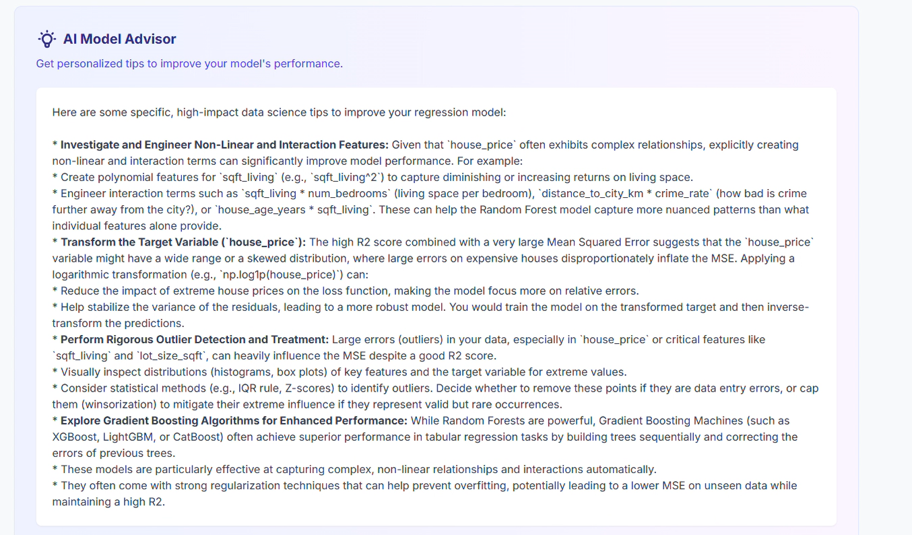

This looks like a great set of technical features for a showcase post! Here is the content formatted in clean Markdown:

## 🚀 Tech Highlights: AutoML Wizard

Here are the core technical features and capabilities of the application:

### 1. ⚙️ End-to-End Guided Workflow

* **Upload & Analyze:** Simple CSV upload followed by automatic data profiling (types, missing counts).
* *This step is crucial for initial data health assessment.*

* **Data Cleaning:** Built-in Imputation strategies: Fill with Mean, Median, Mode, or Drop Rows. Users can apply strategies selectively.
* **Feature Config:** Intuitive selection of Target (Y) and Feature (X) columns for rapid experimentation.

### 2. 💪 Powerful ML Core

* **Algorithm Choice:** Select from common regression models: Linear Regression, Ridge Regression, and Random Forest.
* **Evaluation:** Immediate display of **R² Score** and **MSE** upon training completion.

### 3. 🧠 AI-Powered Model Advisor

* **Gemini Integration:** The star feature! Integrated the **Gemini API** to analyze the model's metrics and data statistics.
* **Contextual Tips:** The AI Model Advisor generates personalized, contextual tips on how to improve the model, offering genuine data science insights to the user.

### 4. 🎨 Modern UI/UX

* **Stack:** Responsive, clean interface built with **React** and **Tailwind CSS**.
* **Visualizations:** Dynamic visualizations using **Recharts** (Actual vs. Predicted Lines, Scatter Plots) for quick performance assessment.

 

 

 

 

 

 

## ✨ Key Features of the AutoML Wizard Project

This project is a fantastic demonstration of a full-stack, browser-based AutoML (Automated Machine Learning) workflow combined with AI-powered guidance.

Based on the provided code, here is a detailed list of features, categorized for your LinkedIn post:

---

### 1. ⚙️ End-to-End ML Workflow

* **Guided 5-Step Process:** Users are guided through a clear, multi-step pipeline for model building, from data ingestion to final evaluation.
* **Data Ingestion:** Supports local **CSV file upload** with client-side parsing (`parseCSV`).
* **Data Analysis:** Automatically analyzes column statistics (data type, missing counts, sample data) immediately after upload.
* **Train/Test Split:** Customizable slider to set the **data split ratio** (e.g., 80% train / 20% test).

### 2. 🧼 Data Preprocessing & Cleaning

* **Missing Value Handling:** Provides multiple strategies for imputation and cleaning:
* **Fill with Mean** (`fill_mean`)
* **Fill with Median** (`fill_median`)
* **Fill with Mode** (`fill_mode`)
* **Drop Rows** (`drop_rows`)

* **Targeted Cleaning:** Allows users to selectively apply cleaning methods only to columns that contain missing values.

### 3. 🧠 Model Configuration & Training

* **Feature Selection:** Intuitive interface to select the **Target Variable (Y)** and multiple **Feature Variables (X)** for regression problems.
* **Algorithm Selection:** Supports selection from popular regression algorithms:
* **Linear Regression** (`linear_regression`)
* **Ridge Regression** (`ridge`)
* **Random Forest** (`random_forest`)

* **Simulated Training:** Includes a training delay simulation (`setTimeout`) for a realistic user experience.

### 4. 📈 Model Evaluation & Visualization

* **Key Metrics Display:** Immediately shows essential regression metrics:
* **R² Score** (Coefficient of Determination)
* **Mean Squared Error (MSE)**

* **Interactive Visualization (via Recharts):**
* **Actual vs. Predicted Line Chart:** Visualize model performance against the true values for a sample of the test set.
* **Prediction Scatter Plot:** Graph the relationship between actual vs. predicted values to assess linearity and variance.

### 5. 💡 AI-Powered Advice & Integration

* **Gemini Service Integration:** Connects to the Gemini API (`generateMLTips`) to provide **contextual, personalized advice**.
* **Model Advisor:** Generates **AI Model Advisor** tips based on the trained model's configuration (`modelConfig`), performance metrics (`metrics`), and column statistics.
* **Actionable Insights:** Helps users interpret results and suggests next steps for model improvement (e.g., changing features, cleaning, or algorithms).

## Run Locally

**Prerequisites:**  Node.js

1. Install dependencies:
   `npm install`
2. Set the `GEMINI_API_KEY` in [.env.local](.env.local) to your Gemini API key
3. Run the app:
   `npm run dev`
